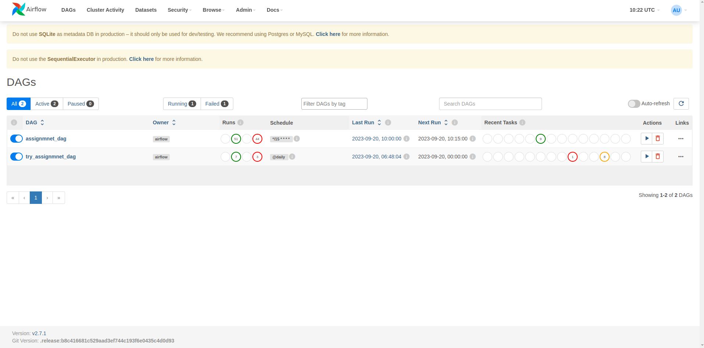
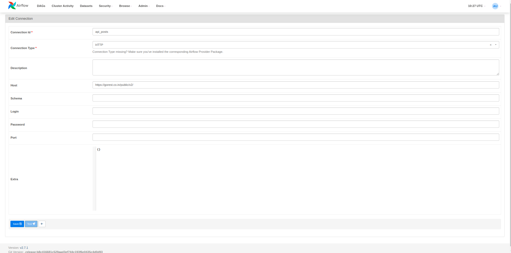
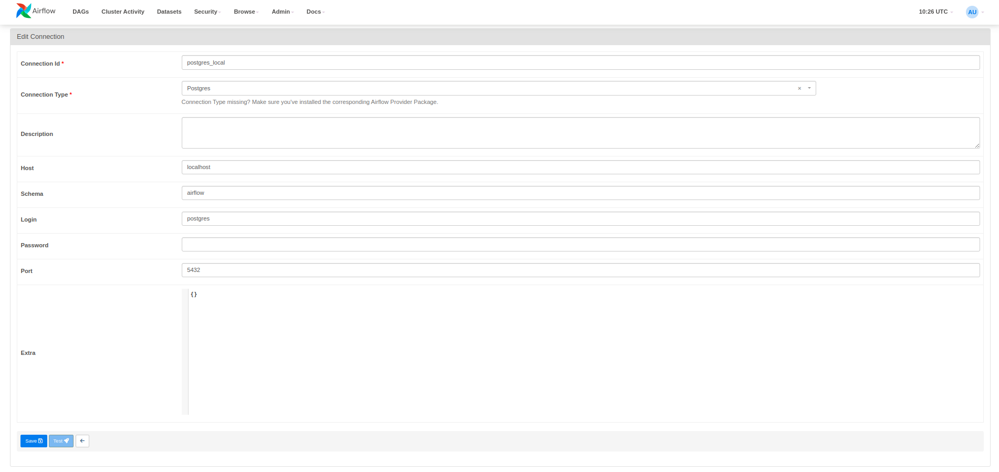
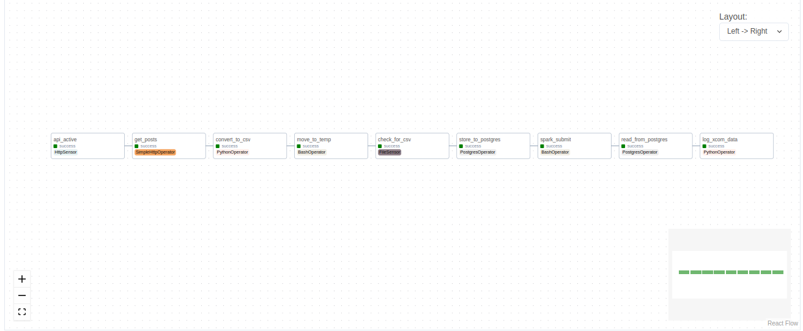
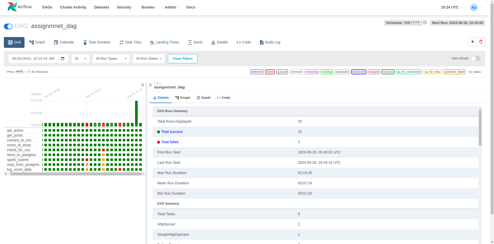
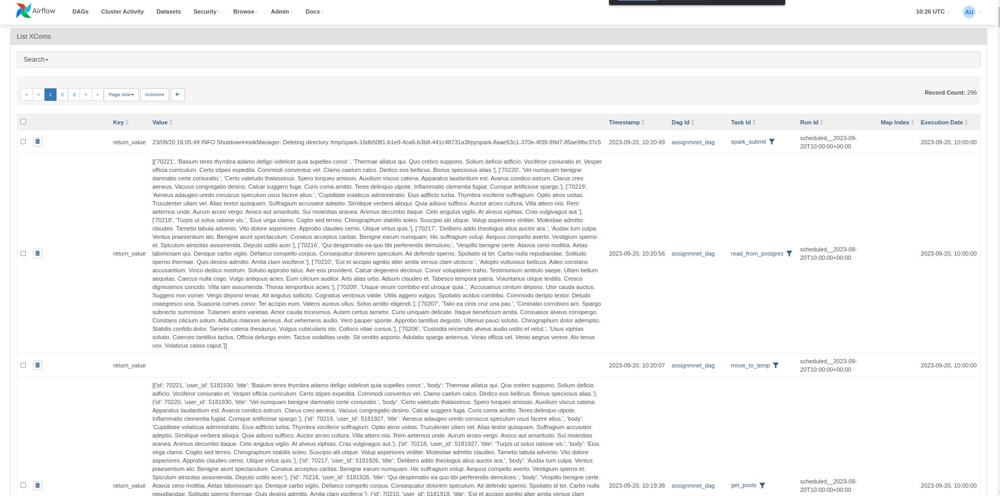

# Airflow Project

This is a project on  Apache Airflow DAG (Directed Acyclic Graph) for an assignment that demonstrates various tasks and dependencies within a data pipeline. The DAG performs operations like making HTTP requests to an API, processing JSON data, converting it to CSV, moving files, checking file existence, storing data in a PostgreSQL database, and running a Spark job.

## Prerequisites
Before running this DAG, ensure you have the following:

- Apache Airflow installed and configured.
- PostgreSQL database connection set up (postgres_local).

## DAG Structure
### DAG Configuration
- DAG ID: `assignment_dag`
- Schedule Interval:` */15 * * * *` (runs every 15 minutes)
- Start Date: `September 10, 2023`
- Catchup: `False`       // doesn't schedule task for the missed dates

### Task Descriptions
- Check API Activity (`api_active`): This task checks if the API is active by making an HTTP request to an endpoint.

- Get Posts (`get_posts`): Retrieve posts data from the API using an HTTP GET request. The response is filtered and logged as JSON.

- Convert to CSV (`convert_to_csv`): Convert the retrieved JSON data into a CSV file and store it in the /home/user/airflow/Assignment_1/posts.csv file.

- Move to Temporary Directory (`move_to_temp`): Move the generated CSV file to the /tmp directory.

- Check for CSV File (`check_for_csv`): Check for the existence of the CSV file in the /tmp directory at regular intervals.

- Store to PostgreSQL (`store_to_postgres`): Store the CSV data into a PostgreSQL database. This task creates a table (airflow) if it doesn't exist, truncates the table, and copies data from the CSV file.

- Submit Spark Job (`spark_submit`): Submit a Spark job using spark-submit. The command includes the path to the Spark driver class and the JAR file for PostgreSQL.

- Read from PostgreSQL (`read_from_postgres`): Read data from a PostgreSQL database, specifically from the posts_spark table.

- Log XCom Data (`log_xcom_data`): Log data retrieved from XCom (cross-communication) in a human-readable table format.

### Task Dependencies
The DAG has the following task dependencies:

- *task_is_api_active* must complete successfully before *task_get_posts* can run.
- *task_get_posts* must complete successfully before *task_convert_to_csv* can run.
- *task_convert_to_csv* must complete successfully before *task_move_to_temp* can run.
- *task_move_to_temp* must complete successfully before *task_check_file* can run.
- *task_check_file* must complete successfully before *task_store_to_postgres* can run.
- *task_store_to_postgres* must complete successfully before *task_spark_submit* can run.
- *task_spark_submit* must complete successfully before *task_read_from_postgres* can run.
- *task_read_from_postgres* must complete successfully before *task_log* can run.

## Airflow operators used
- HttpSensor (HttpSensor):

    - This operator is used to check if an API is active by making an HTTP request to a specified endpoint.It waits until the API responds with an expected HTTP status code before proceeding with the workflow.

- SimpleHttpOperator (SimpleHttpOperator):

    - This operator is used to perform an HTTP GET request to retrieve data from an API endpoint. It can handle HTTP responses, and in this DAG, it filters and logs the JSON response from the API. We can customize the request method and handle the response as needed.

- PythonOperator (PythonOperator):

    - This operator allows you to execute arbitrary Python functions as tasks within your DAG. In this DAG, it is used to call the convert_to_csv function, which converts JSON data to CSV and stores it.

- BashOperator (BashOperator):
    - The BashOperator is used to execute shell commands or scripts as part of your workflow. In this DAG, it is used to move the generated CSV file to the /tmp directory and to submit a Spark job using spark-submit.

- FileSensor (FileSensor):

    - This operator is used to monitor the existence of a file at a specified path. In this DAG, it checks for the existence of the CSV file in the /tmp directory at regular intervals.

- PostgresOperator (PostgresOperator):

    - The PostgresOperator is used to interact with PostgreSQL databases.
In this DAG, it is used to create a table if it doesn't exist, truncate the table, and copy data from the CSV file into the PostgreSQL database.

###  Why not use SparkOperator in this project?
The spark submit was not successfull using the SparkOperator so this project uses BashOperator to provide the spark-submit commad from the bash.

## Api used
This project uses api from the endpoint:     `https://gorest.co.in/public/v2/posts`
## Airflow UI
The Apache Airflow UI, often referred to as the Airflow Web UI or simply the Airflow UI, is a user interface provided by Apache Airflow for managing, monitoring, and visualizing workflows and DAGs (Directed Acyclic Graphs) making it user-friendly and essential for orchestrating data pipelines.
It runs in localhost port 8080.

##### General overview of the Airflow UI:

Connection setup for https and postgres in airflow ui
- Go to Admin-> Connections -> add_connection_button
For https:

For postgres:

#### Graph view of the logs:

#### Bar view and details of the log:

#### Xcom in Airflow UI :

### Usage
Ensure that Apache Airflow is up and running.

Make sure you have the required connections and dependencies configured as mentioned in the prerequisites.

Trigger or schedule the assignment_dag as needed.Use the following cmd:
- airflow standalone 
- airflow scheduler

*Modify the file paths, database connections, and Spark job details as per your environment and requirements.*

